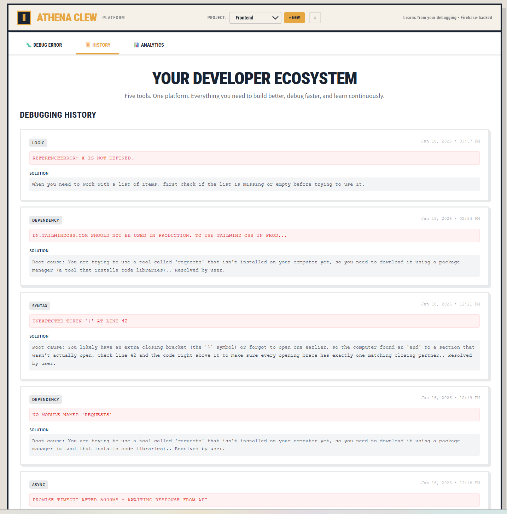
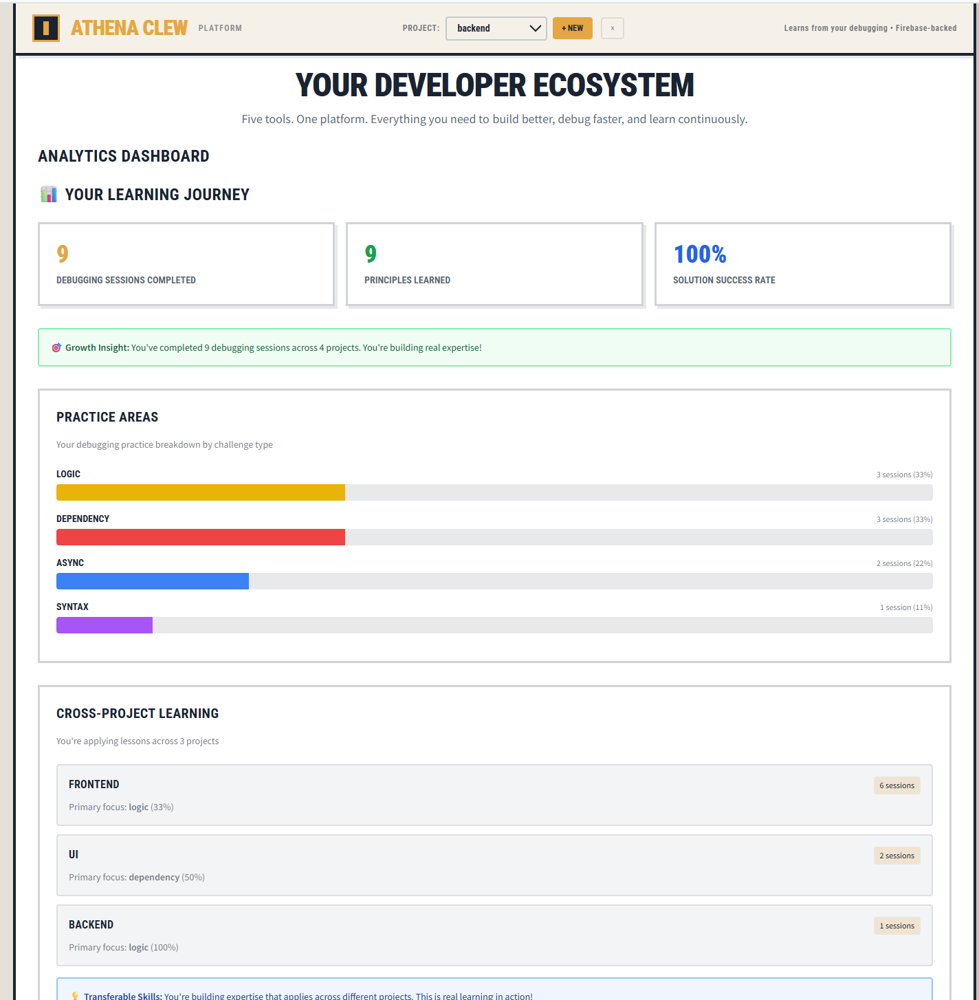

# 🚀 Theseus Clew | Autonomous Debugging with Gemini 3 Deep Thinking

> **The AI that remembers what you fix.**  
> *Part of the Athena Clew Ecosystem.*

---

## 🎯 The Problem: AI "Amnesia"

Most AI coding assistants treat every error like it's the first time they've seen it. You explain the context, fix the bug, and move on. When the bug happens again a week later, the AI has forgotten everything.

## 🧠 The Solution: Theseus Clew

**Theseus** is an autonomous agent that **learns from your debugging sessions**.

Powered by **Gemini 3 Deep Thinking**, it doesn't just patch code—it **extracts reusable principles** from your fixes and stores them in a long-term knowledge graph. When you encounter a similar error later (even in a different project), Theseus shouts **"Déjà Vu!"** and reminds you how you solved it last time.

---

## 🚀 Live Demo

**[Launch Theseus Clew →](https://athena-clew-675122416902.us-central1.run.app/)**

**[Watch the Demo Video →](https://youtu.be/LpWZUh1X-RU)**

*Paste an error. Get intelligent analysis. Watch Theseus learn.*


---

## ✨ Key Features

### 🧠 Theseus Clew — The Autonomous Debugging Agent
**5-Step Multi-Step Orchestration Pipeline:**

```
┌─────────────────────────────────────────────────────────────────┐
│                    THESEUS 5-STEP PIPELINE                      │
└─────────────────────────────────────────────────────────────────┘

 INPUT: User pastes error message
    │
    ▼
┌───────────────────────────────────────┐
│ STEP 1: Deep Error Analysis           │  ◄── Gemini 3 Deep Thinking
│   • Classify: syntax/dependency/logic │      (5000 token budget)
│   • Extract patterns from stack trace │
│   • Plain-language root cause         │
└───────────────────────────────────────┘
    │
    ▼
┌───────────────────────────────────────┐
│ STEP 2: Historical Search             │  ◄── Firestore Query
│   • Search THIS project's past fixes  │      (<500ms response)
│   • Cross-project fallback search     │
│   • Rank by success rate              │
└───────────────────────────────────────┘
    │
    ▼
┌───────────────────────────────────────┐
│ STEP 3: Principle Extraction          │  ◄── Gemini 3 Deep Thinking
│   • Generalize solution to principle  │      (3000 token budget)
│   • Format: "When X, then Y"          │
│   • Reusable across projects          │
└───────────────────────────────────────┘
    │
    ▼
┌───────────────────────────────────────┐
│ STEP 4: Cross-Project Matching        │  ◄── Semantic Ranking
│   • Query all learned principles      │
│   • Jaccard similarity scoring        │
│   • Rank by relevance + success rate  │
└───────────────────────────────────────┘
    │
    ▼
┌───────────────────────────────────────┐
│ STEP 5: Autonomous Learning           │  ◄── Zero Human Prompting
│   • User clicks "This Helped!"        │
│   • Principle stored automatically    │
│   • Success rate updated              │
│   • Knowledge base grows              │
└───────────────────────────────────────┘
    │
    ▼
 OUTPUT: Intelligent suggestion + Principle learned
```


### 📜 Debugging History
Every troubleshooting session is preserved in your history. You can revisit past fixes, review the AI's reasoning, and see exactly which principles were applied. It's not just a log—it's your personalized debugging textbook.



### 🔮 Déjà Vu Detection
When you encounter an error you've seen before—across ANY project—Theseus recognizes it instantly using Jaccard similarity matching.


*"You worked through this in your "backend" project on 1/18/2026:"*

### 📊 Personal Analytics Dashboard
Track your growth as a debugger:
- **Error Type Breakdown** — See your most common challenges
- **Cross-Project Learning** — Watch principles transfer between projects
- **Knowledge Base** — Your top principles ranked by success rate
- **Growth Metrics** — Evidence-based proof of improvement



### 🧩 The Clew Suite — One Platform, Five Tools

**Athena Clew** is the unified ecosystem that connects these tools. It provides the shared memory (Firestore), the reasoning engine (Gemini 3), and the identity layer that allows "The Clew Suite" to work together as a cohesive AI team.

| Tool | Status | Description |
|------|--------|-------------|
| **Theseus Clew** | 🆕 NEW | Autonomous debugging agent (Gemini 3) |
| **[Lumen Clew](https://lumenclew.lovable.app)** | ✅ Live | Code health scanner with plain-language insights |
| **[Metis Clew](https://metis-clew.vercel.app)** | ✅ Live | AI code explainer (WHAT, HOW, WHY) |
| **Janus Clew** | 🏆 Coming | Repository analyzer & career guidance |
| **Ariadne Clew** | 🔮 Coming | Chat transcript reasoning preservation |

> **🏆 Janus Clew** won **[AWS Global Vibe: AI Coding Hackathon 2025](https://dorahacks.io/hackathon/awsvibecoding/winner)** and earned a scholarship to **Draper University Cohort 2026**

---

## 🏗️ Architecture

### System Overview

```
┌─────────────────────────────────────────────────────────────────┐
│                     ATHENA CLEW PLATFORM                        │
├─────────────────────────────────────────────────────────────────┤
│                                                                 │
│  ┌──────────────┐    ┌──────────────┐    ┌──────────────┐       │
│  │   Browser    │    │   Gemini 3   │    │  Firestore   │       │
│  │  (Vanilla JS)│◄──►│  Flash API   │◄──►│  Database    │       │
│  │              │    │              │    │              │       │
│  │ • index.html │    │ • Analyze    │    │ • Sessions   │       │
│  │ • app.js     │    │ • Extract    │    │ • Projects   │       │
│  │ • ui.js      │    │ • Rank       │    │ • Fixes      │       │
│  │ • gemini.js  │    │              │    │ • Principles │       │
│  └──────────────┘    └──────────────┘    └──────────────┘       │ 
│                                                                 │
│  ┌─────────────────────────────────────────────────────────┐    │
│  │                    DATA FLOW                            │    │
│  │                                                         │    │
│  │  Error Input ──► Step 1 (AI) ──► Step 2 (DB) ──►        │    │
│  │  Step 3 (AI) ──► Step 4 (AI+DB) ──► Step 5 (DB)         │    │
│  │                                                         │    │
│  │  AI = Gemini 3 Deep Thinking                            │    │
│  │  DB = Firestore Queries                                 │    │
│  └─────────────────────────────────────────────────────────┘    │
│                                                                 │
└─────────────────────────────────────────────────────────────────┘
```

### Firestore Schema (V2 Multi-Project)

```
firestore/
├── sessions/
│   └── {sessionId}
│       ├── createdAt: timestamp
│       ├── lastActive: timestamp
│       ├── currentProjectId: string
│       │
│       └── projects/                    ◄── V2: Multi-project support
│           └── {projectId}
│               ├── projectName: string
│               ├── techStack: string[]
│               │
│               ├── fixes/               ◄── Debugging history
│               │   └── {fixId}
│               │       ├── error: { message, stack, type }
│               │       ├── fix: { solution, explanation }
│               │       ├── geminiThinking: { tokensUsed, responseTime }
│               │       ├── userFeedback: { helpful: boolean }
│               │       └── linkedPrinciples: string[]
│               │
│               └── principles/          ◄── Learned knowledge
│                   └── {principleId}
│                       ├── principle: "When X, then Y"
│                       ├── category: string
│                       ├── context: { successRate, appliedCount }
│                       └── linkedFixes: string[]
```

### Tech Stack

| Layer | Technology | Why |
|-------|------------|-----|
| **Frontend** | Vanilla JavaScript | Occam's Razor: simplest solution that works |
| **Styling** | Tailwind CSS (CDN) | Rapid prototyping, no build step |
| **AI** | Gemini 3 Flash Preview | Deep Thinking capability for reasoning |
| **Database** | Firestore | Real-time, serverless, Firebase ecosystem |
| **Hosting** | Google Cloud Run | Containerized, scalable |
| **SDK** | Firebase AI Logic v12.6.0 | Modular SDK with GoogleAIBackend |

---

## 🔧 Setup & Installation

### Prerequisites

- Node.js 18+
- Firebase CLI (`npm install -g firebase-tools`)
- Google AI API Key (from [Google AI Studio](https://aistudio.google.com/))

### Quick Start

```bash
# 1. Clone the repository
git clone https://github.com/earlgreyhot1701D/Athena-Clew.git
cd Athena-Clew

# 2. Install dependencies
npm install

# 3. Configure Firebase
# Copy the example config and add your keys:
cp public/firebase-config.example.js public/firebase-config.js
# Edit public/firebase-config.js with your API keys

# 4. Start local development server
npm start
# Opens http://localhost:8080

# 5. Deploy to Firebase Hosting
firebase login
firebase deploy
```

### Firestore Indexes

Deploy required indexes:
```bash
firebase deploy --only firestore:indexes
```

Indexes are defined in `firestore.indexes.json`:
- `fixes`: Composite index on `error.type` + `timestamp`
- `principles`: Composite index on `category` + `context.successRate`

---

## 🧪 Testing

### Unit Tests

```bash
# Run all Jest tests
npm test

# Tests cover:
# - session.test.js    - Session management
# - firestore.test.js  - Database operations
# - gemini.test.js     - AI integration
# - projects.test.js   - Multi-project logic
# - integration.test.js - Full pipeline E2E
```

### E2E Tests

```bash
# Run Playwright E2E tests
npm run test:e2e
```

---

## 🎓 Lessons Learned

### 1. Occam's Razor Wins Hackathons

> "Simplest solution that ships bulletproof scores higher than ambitious solution that crashes."

We chose:
- ✅ Vanilla JS over React (no build complexity)
- ✅ Firebase only, no Express server (serverless = zero DevOps)
- ✅ Session IDs over auth (no login friction for demo)
- ✅ Tailwind CDN over custom CSS (faster iteration)

### 2. Build V2 Schema on Day 1

Our Firestore schema was designed for multi-project from the start:
```
sessions/{sessionId}/projects/{projectId}/fixes/...
```

This avoided painful migrations. V1 just uses `default-project`, V2 unlocks full multi-project with zero schema changes.

### 3. AI Fallbacks Are Non-Negotiable

Gemini 3 rate limits? No problem. Every AI call has a fallback:

```javascript
// gemini.js
async analyzeError(errorData) {
    if (!this.model) {
        return {
            classification: this._fallbackClassification(errorData.message),
            rootCause: 'AI analysis unavailable. Using fallback.',
            confidence: 0.3
        };
    }
    // ... actual AI call
}
```

### 4. QA-First > Build-First

Every feature started with:
1. **Define success criteria** (written)
2. **Write verification tests** (before code)
3. **Build minimum code** to pass tests
4. **Verify** and iterate

### 5. Firebase AI Logic SDK Gotchas

**Critical Discovery:** The Web SDK uses `camelCase`, not `snake_case`:

```javascript
// ❌ Wrong (Vertex AI Python style)
thinking: { budget_tokens: 5000 }

// ✅ Correct (Firebase AI Logic Web SDK)
thinkingConfig: { thinkingBudget: 5000 }
```

**Also:** Use `GoogleAIBackend` for free tier, not `VertexAIBackend`:
```javascript
const ai = getAI(app, { backend: new GoogleAIBackend() });
```

---

## 📁 File Structure

```
Athena-Clew/
├── public/                      # Frontend (served by Firebase Hosting)
│   ├── index.html              # Main app shell + Firebase SDK init
│   ├── app.js                  # Main orchestrator (5-step pipeline)
│   ├── gemini.js               # Gemini 3 API integration
│   ├── firestore.js            # Database operations
│   ├── session.js              # Session management
│   ├── projects.js             # Multi-project logic
│   ├── ui.js                   # DOM manipulation
│   ├── analytics.js            # Analytics aggregation
│   ├── personal-insights.js    # Déjà vu detection + patterns
│   ├── history.js              # History view rendering
│   ├── analytics-view.js       # Analytics dashboard
│   ├── firebase-config.js      # API keys (gitignored)
│   ├── styles.css              # Custom styles
│   └── utils/
│       ├── classifier.js       # Error classification fallback
│       ├── error-handler.js    # Global error handling
│       └── logger.js           # Logging utility
│
├── tests/                       # Jest + Playwright tests
│   ├── integration.test.js     # Full pipeline E2E
│   ├── session.test.js
│   ├── firestore.test.js
│   ├── gemini.test.js
│   ├── projects.test.js
│   ├── ui.test.js
│   └── setup.js                # Test configuration
│
├── docs/
│   └── screenshot.png          # App screenshot (also in public/Screenshot/)
│
├── firebase.json               # Firebase Hosting config
├── firestore.rules             # Security rules
├── firestore.indexes.json      # Database indexes
├── Dockerfile                  # Container deployment
├── package.json                # Dependencies
├── jest.config.js              # Test config
├── TROUBLESHOOTING.md          # Critical fixes documented
└── README.md                   # You are here
```

---

## 🗺️ Roadmap

### V1.0 (Hackathon Submission) ✅
- [x] 5-step autonomous debugging pipeline
- [x] Gemini 3 Deep Thinking integration
- [x] Multi-project architecture
- [x] Cross-project déjà vu detection
- [x] Analytics dashboard
- [x] Cloud Run deployment

### V1.5 (Post-Hackathon)
- [ ] Documentation lookup integration
- [ ] Fallback chain (3-tier resolution)
- [ ] Web search for Stack Overflow
- [ ] Enhanced similarity algorithms

### V2.0 (Full Platform)
- [ ] User authentication + cloud backup
- [ ] Janus Clew integration (AWS AgentCore)
- [ ] Ariadne Clew integration (reasoning artifacts)
- [ ] Team collaboration features
- [ ] Cross-session learning (community knowledge)

---

## 🏆 Hackathon Compliance

| Requirement | Implementation |
|-------------|----------------|
| **Uses Gemini 3 Deep Thinking** | `thinkingBudget: 5000` in Step 1 & 3 |
| **Multi-Step Orchestration** | 5 distinct steps, each logged |
| **Sophisticated AI (Not Wrapper)** | Classification, extraction, ranking |
| **Autonomous Learning** | Step 5 stores principles automatically |
| **Complete & Polished** | No crashes, WCAG accessible, responsive |
| **Public Demo** | [Live on Cloud Run](https://athena-clew-675122416902.us-central1.run.app/) |

---

## 👩‍💻 Author

**La Shara Cordero** — Builder of the Clew Suite

- 🏆 [AWS Global Vibe Hackathon 2025 Winner](https://dorahacks.io/hackathon/awsvibecoding/winner) (Janus Clew)
- 🎓 Draper University Cohort 2026 Scholarship Recipient
- 💼 [LinkedIn](https://www.linkedin.com/in/la-shara-cordero-a0017a11/)
- 📧 [GitHub](https://github.com/earlgreyhot1701D)

---

## 📜 License

MIT License — See [LICENSE](LICENSE) for details.

---

## 🙏 Acknowledgments

- **Google DeepMind** — For Gemini 3 and this incredible hackathon opportunity
- **Firebase** — For the AI Logic SDK and amazing developer experience
- **The Vibe Coding Community** — For proving that learning by building is valid

### 🤖 Built With AI Assistance

This project was built with **Claude (Anthropic)** and **AntiGravity** as AI co-pilots. All architectural decisions, debugging choices, and mistakes are mine. 

**Human-approved. AI-assisted.** Every line was reviewed, understood, and intentionally shipped.

---

<p align="center">
  <strong>Built by vibecoders, for vibecoders.</strong><br>
  <em>The Clew Suite: Wisdom from many sources, unified on one platform.</em>
</p>

---

*"Every error is a teacher. Theseus remembers every lesson."* 🧵
